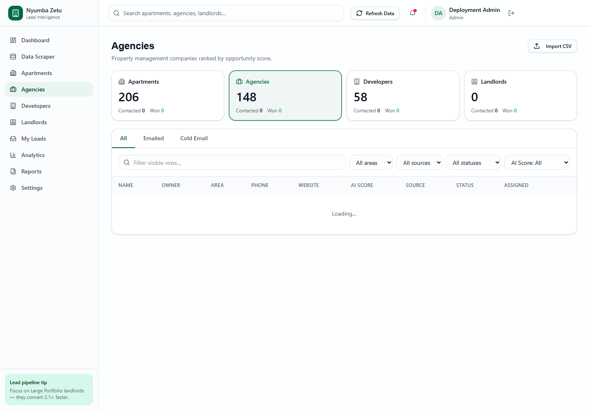
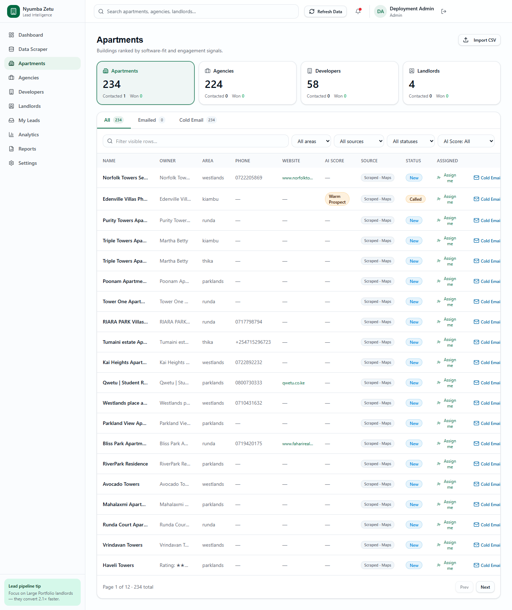
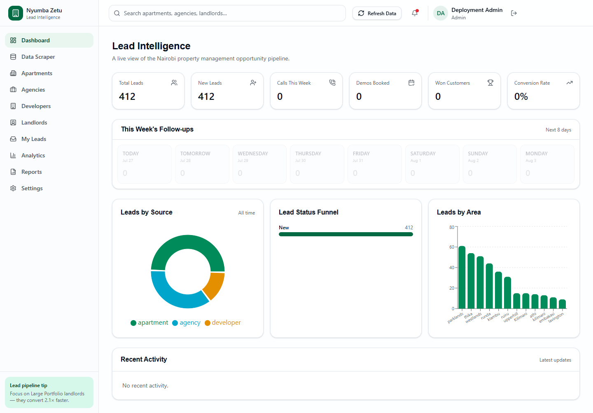
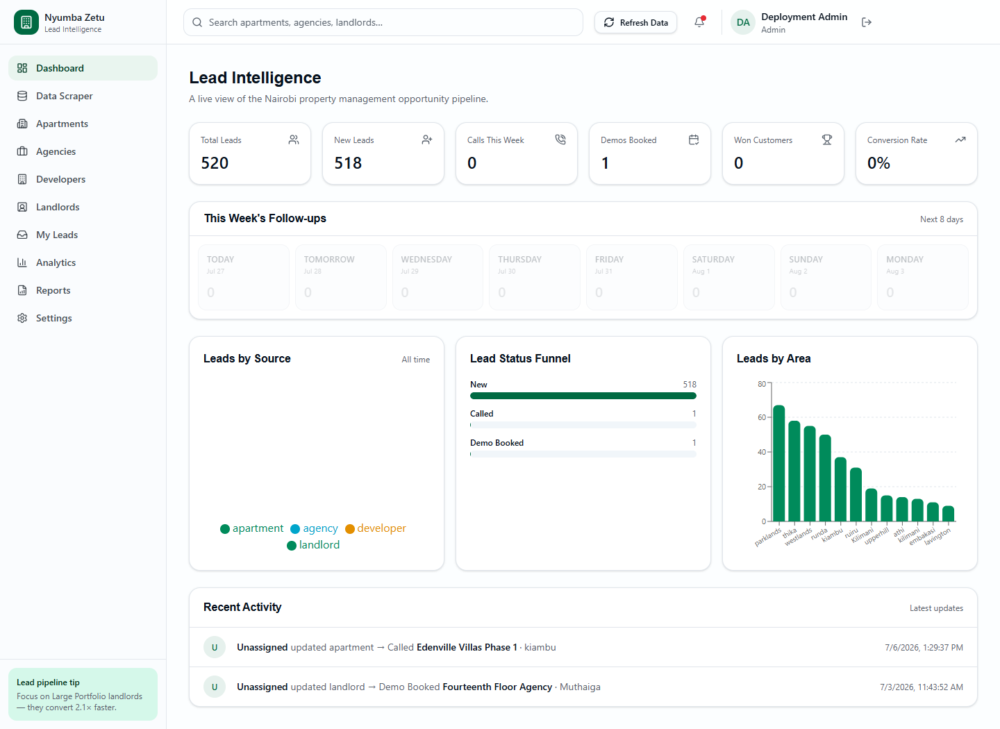
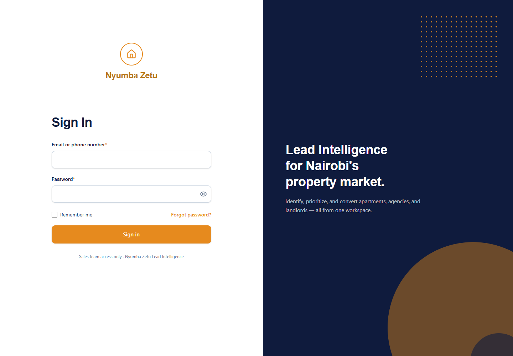
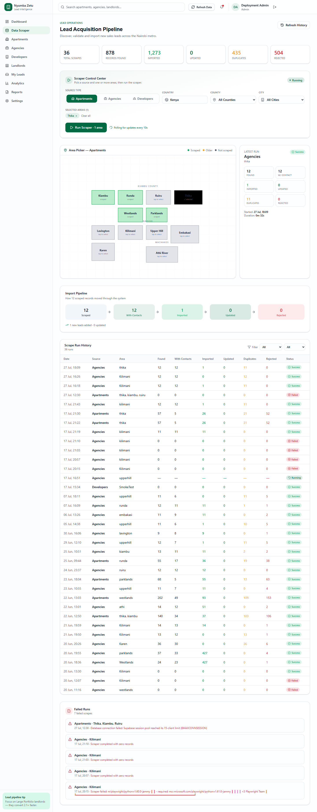
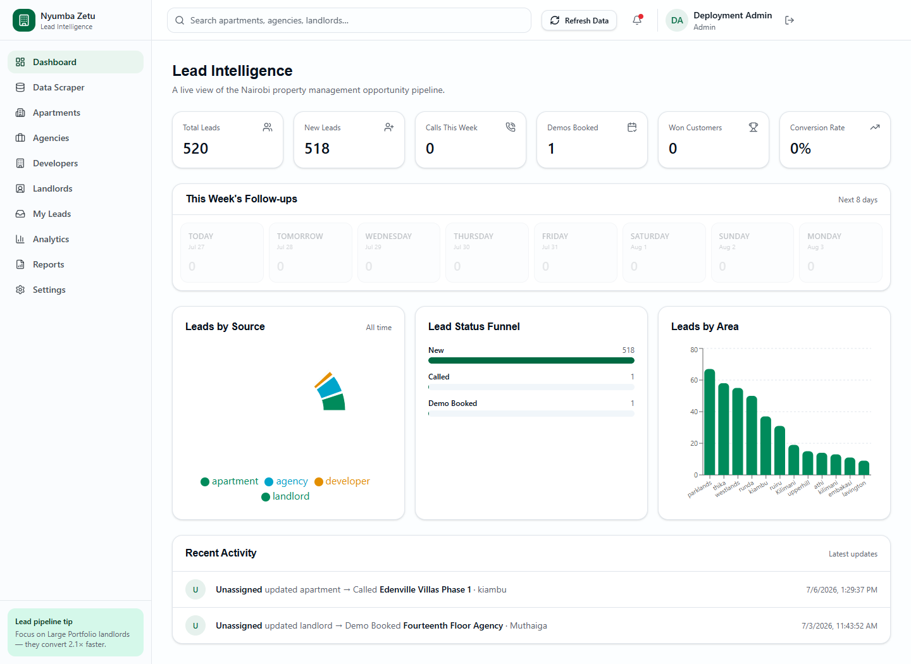
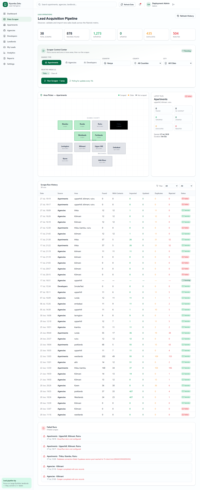

# Frontend QA Report: Nyumba Zetu Lead Intelligence

| Field | Value |
|-------|-------|
| **Date** | 2026-07-27 |
| **App URL** | https://nyumba-lead-hub.vercel.app |
| **Browser** | Codex built-in browser using Chrome |
| **Scope** | Authentication and every top-level authenticated route |
| **Local verification** | Production-mode frontend on `127.0.0.1:4173` with fixed API on `127.0.0.1:8001` |

## Summary

| Severity | Count |
|----------|-------|
| Critical | 0 |
| High | 1 |
| Medium | 1 |
| Low | 1 |
| **Total** | **3** |

## Issues

### ISSUE-001: Lead tables remain stuck on Loading

| Field | Value |
|-------|-------|
| **Severity** | high |
| **Category** | functional / console |
| **URLs** | `/apartments`, `/agencies`, `/developers`, `/landlords` |
| **Repro Video** | N/A |

**Description**

Each lead-type page calls `GET /api/leads/outreach`, but the production API
returns `404`. The table never leaves its `Loading...` state and the browser
console records repeated failed-resource errors. Other summary requests on the
same pages return `200`, so the failure is isolated to the outreach contract.

**Repro Steps**

1. Sign in and navigate to Agencies.
2. Observe that the summary cards populate while the table remains on
   `Loading...`.
3. Inspect network traffic and observe two `404` responses for
   `/api/leads/outreach?lead_type=agency&filter_by=all`.

**Minimal fix and justification**

The frontend contract was valid, but the FastAPI route did not exist. A static
`GET /api/leads/outreach` route was added before the dynamic `/api/leads`
route. It returns only the pagination, outreach counts, and latest-sent-email
fields already consumed by the four pages. This is smaller and safer than
rewriting four working frontend screens around a less-specific endpoint.

**Verified result**

All eight outreach requests made by Apartments, Agencies, Developers, and
Landlords return `200`; tables render real rows and no longer show `Loading...`
or `Failed to load leads`.

### ISSUE-002: Dashboard serializes a filter object into the URL

| Field | Value |
|-------|-------|
| **Severity** | medium |
| **Category** | functional |
| **URL** | `/` |
| **Repro Video** | N/A |

**Description**

The dashboard requests
`/api/dashboard/by-area?lead_type=[object%20Object]`. The endpoint returns `200`,
but the request cannot apply the intended filter because a JavaScript object was
serialized instead of a lead-type string.

**Repro Steps**

1. Sign in and open the dashboard.
2. Inspect fetch requests.
3. Observe the malformed `lead_type=[object Object]` query.

**Minimal fix and justification**

TanStack Query passes a query-context object to a bare `queryFn`. The dashboard
now calls `() => dashboardApi.byArea()` explicitly, and the API helper accepts
only a string filter. The backend also applies the optional `lead_type` filter
instead of silently ignoring it. This fixes both ends of the contract without
changing the chart or query-cache behavior.

**Verified result**

The dashboard requests `/api/dashboard/by-area` with no malformed query. The
lead-type pages request valid string filters such as
`?lead_type=apartment`; all return `200`.

### ISSUE-003: Password fields omit autocomplete metadata

| Field | Value |
|-------|-------|
| **Severity** | low |
| **Category** | accessibility / console |
| **URLs** | `/signin`, `/change-password` |
| **Repro Video** | N/A |

**Description**

Chrome reports that the current-password and new-password inputs are missing
their expected `autocomplete` attributes. This reduces password-manager support
and adds console noise on authentication pages.

**Repro Steps**

1. Open the sign-in page.
2. Inspect the browser console.
3. Observe the missing `current-password` autocomplete warning.

**Minimal fix and justification**

The sign-in fields now use `username` and `current-password`; the password
change fields use `current-password` and `new-password`. These are native HTML
attributes, so they improve password-manager and browser behavior without
changing authentication logic or styling.

## Data integrity audit and recovery

The four visible runs were not caused by a frontend filter. The main database
contained only four July 27 runs, while the verified July 17 snapshots contained
32 earlier run headers and 146 audit rows. It also had zero lead notes/events
and was missing historical leads.

Recovery was dry-run first, then applied additively in one transaction after
backing up every modified table. Current rows were never deleted or overwritten.
The resulting main database has:

- 36 scraper runs and 182 run-audit rows;
- 520 leads, including 107 recovered historical rows and all newer rows;
- 10 lead notes and 6 lead events.

A repeat dry run matched all 428 snapshot leads and proposed zero inserts. The
pre-recovery backup is
`C:\Users\akioko.INDRALIMITED\SalesIntelligenceMigrationBackups\20260727T154307Z`.

## Final browser result

The built-in browser visited Dashboard, Data Scraper, Apartments, Agencies,
Developers, Landlords, My Leads, Analytics, Reports, and Settings against the
local fixed stack. There were zero console errors, zero failed requests, zero
HTTP responses at or above 400, and no page remained in an error/loading state.

After Cloud Run revision `sales-intelligence-api-00026-lkr` received 100%
production traffic, the same ten-route browser pass was repeated against
`https://nyumba-lead-hub.vercel.app`. The deployed (older) frontend's malformed
`[object Object]` dashboard filter was ignored by the backward-compatible API;
all eight outreach calls returned `200`. The live pass again recorded zero
console errors, failed requests, HTTP 4xx/5xx responses, or stuck pages.

The normal Vite dev server produced a React hydration warning from Lovable's
development-only source tagger because its `data-tsd-source` line metadata
differs between server and client transforms. Production does not include the
tagger and showed no such warning, so no application code was changed for that
tooling-only observation.
